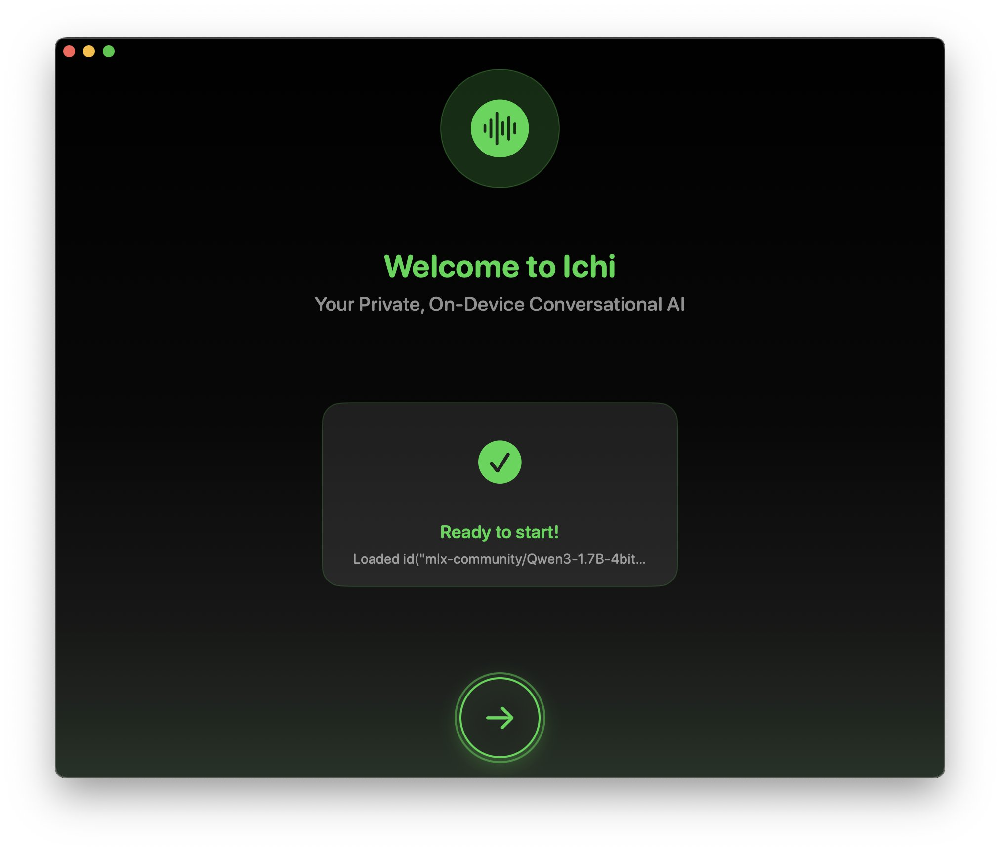

# Ichi

*Ichi (一)* means "one" in Japanese, representing this project to unify conversational AI across Apple platforms. One of the personal aim was to create a Japanese tutor to learn basics of the language for my trip to Shibuya, Tokyo, Japan.

## Support

Love this project? Check out my books to explore more of AI and iOS development:
- [Exploring AI for iOS Development](https://academy.rudrank.com/product/ai)
- [Exploring AI-Assisted Coding for iOS Development](https://academy.rudrank.com/product/ai-assisted-coding)

Your support helps to keep this project growing!

## Overview

Ichi is an experimental project that explores conversational AI capabilities across iOS, macOS, and visionOS. The project's name is inspired by a Japanese women I met at a conference, who ignited the spark into coding again.

Last September, using online providers for speech-to-speech was expensive, and I wanted to take the on-device route instead. Local LLMs are still not there *yet*, but one day.

## Features

- **Privacy-First**: All processing happens on-device - no data leaves your device
- **Conversational AI**: Powered by on-device LLMs (Qwen model)
- **Speech Recognition**: Real-time speech-to-text conversion
- **Text-to-Speech**: Natural voice synthesis using Kokoro TTS
- **Cross-Platform**: Supports iOS, macOS, and visionOS
- **Beautiful UI**: Modern SwiftUI interface with smooth animations
- **Onboarding**: Guided setup with model downloads
