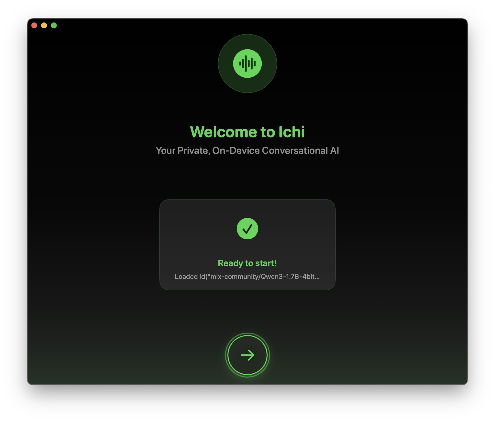

# Ichi

*Ichi (一)* means "one" in Japanese, representing this project to unify conversational AI across Apple platforms. One of the personal aim was to create a Japanese tutor to learn basics of the language for my trip to Shibuya, Tokyo, Japan.

## Overview

Ichi is an experimental project that explores conversational AI capabilities on macOS (the only validated platform today), with iOS and visionOS as aspirational targets. The project's name is inspired by a Japanese woman I met at a conference, who ignited the spark into coding again.

Last September, using online providers for speech-to-speech was expensive, and I wanted to take the on-device route instead. Local LLMs are still not there *yet*, but one day.

## Features

- **Privacy-First**: All processing happens on-device - no data leaves your device
- **Conversational AI**: Powered by on-device LLMs (Qwen model)
- **Speech Recognition**: Real-time speech-to-text conversion
- **Text-to-Speech**: Natural voice synthesis using Kokoro TTS
- **Apple Platform UI**: SwiftUI app shell, currently validated on macOS while the MLX audio stack evolves
- **Beautiful UI**: Modern SwiftUI interface with smooth animations
- **Onboarding**: Guided setup with model downloads

